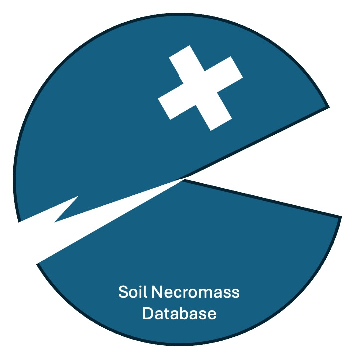

# The Soil Necromass Database (SNDB)

 

Kaizad F. Patel, Avni Malhotra, Sophia A. McKever, Vanessa L. Bailey, Kirsten Hofmockel

The SNDB is a global dataset for soil microbial necromass, compiled using amino sugar data from published studies, 
including primary research papers and meta-analyses. 
We include necromass indices (amino sugar concentrations and calculated bacterial/fungal/microbial necromass values) as well as site and soil-level parameters (e.g. ecosystem type, soil C and N content, microbial biomass, etc.) that provide context to the samples. 

v1.0.0 of this database contains 2668 records from 186 published papers.

---

### Database structure
The database is composed of three files: 

1. `sndb_data.csv` containing the relevant necromass indices and data (see Table 1). This file also contains site and soil-level characteristics of the samples reported. Each record is assigned a unique SNDB record number.
2. `sndb_studies.csv` that contains bibliographic information for each study used in this database (see Table 2). A unique SNDB publication index number is used to map the entries between the two files. 
3. `sndb_metadata.docx` providing full documentation for all fields in the two data files.

### Data access
Users can download the flat (.csv) files from the [`database`](https://github.com/kaizadp/sndb/tree/main/database) folder.  
We request that users cite this dataset and the corresponding database description paper once published. We also encourage users to cite all primary publications and and also involve data contributors as co-authors when possible. 

### Contributing to this database
For future versions, we welcome and encourage data contributions from the broader scientific community. This can be done through this GitHub repository. Potential contributors may create a [Pull Request](https://github.com/kaizadp/sndb/pulls); once validated, these data will be made available on GitHub as part of the database. 

Users may also use [GitHub Issues](https://github.com/kaizadp/sndb/issues) to provide feedback, improvements, or errors in our repository.
