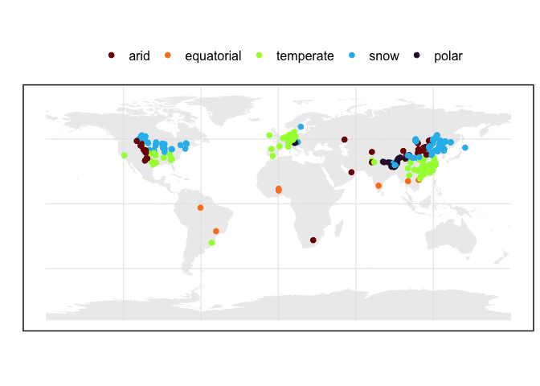
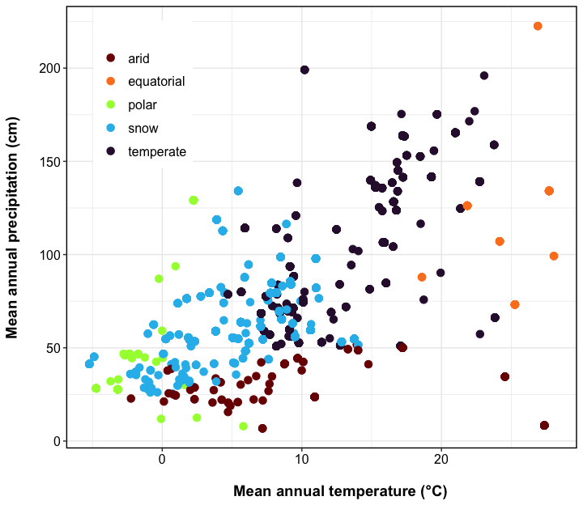
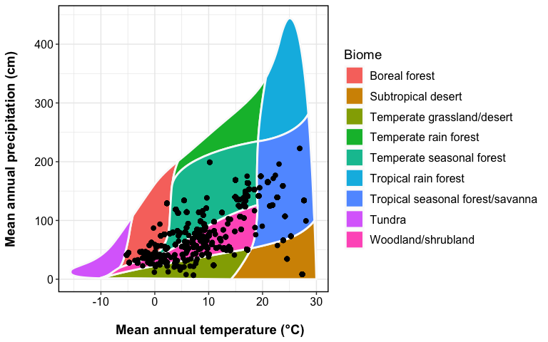
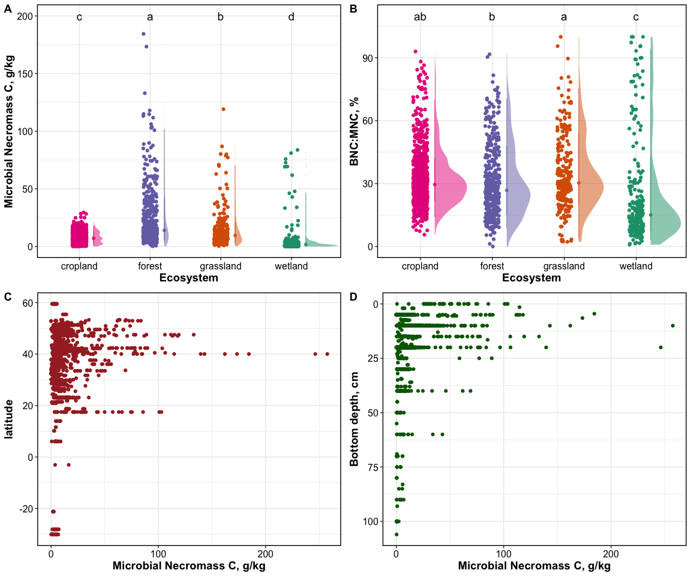
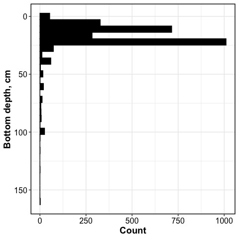

Soil Necromass Database (SNDB): Exploration
================

This report contains code and output for exploratory analysis of the
SNDB v1.0.0.  
This .md file contains the output report. For the code, refer to the
[.Rmd
file](https://github.com/kaizadp/sndb/blob/main/exploratory/report-exploratory.Rmd).

SNDB v1.0.0 contains 2668 records from 186 studies.

## FIGURES

### Geographical Distribution

<!-- -->

### Distribution by MAT-MAP

<!-- -->

### Distribution by Whittaker Biome

<!-- -->

### Distribution by ecosystem

<!-- -->

#### Sample count by depth

<!-- -->

of the 2668 datapoints, 2381 data points are in the top 20 cm (lyr_bot
\>= 20)

------------------------------------------------------------------------

## TABLES

### Sample count by biome

| climate_type |    n |
|:-------------|-----:|
| arid         |  113 |
| equatorial   |   69 |
| polar        |   67 |
| snow         | 1304 |
| temperate    | 1062 |
| NA           |   53 |

### Sample count by ecosystem

| ecosystem |    n |
|:----------|-----:|
| cropland  | 1452 |
| forest    |  511 |
| grassland |  272 |
| wetland   |  418 |
| NA        |   15 |

------------------------------------------------------------------------

Session Info

Date run: 2024-09-19

    ## R version 4.2.1 (2022-06-23)
    ## Platform: x86_64-apple-darwin17.0 (64-bit)
    ## Running under: macOS Big Sur ... 10.16
    ## 
    ## Matrix products: default
    ## BLAS:   /Library/Frameworks/R.framework/Versions/4.2/Resources/lib/libRblas.0.dylib
    ## LAPACK: /Library/Frameworks/R.framework/Versions/4.2/Resources/lib/libRlapack.dylib
    ## 
    ## locale:
    ## [1] en_US.UTF-8/en_US.UTF-8/en_US.UTF-8/C/en_US.UTF-8/en_US.UTF-8
    ## 
    ## attached base packages:
    ## [1] stats     graphics  grDevices utils     datasets  methods   base     
    ## 
    ## other attached packages:
    ##  [1] ggdist_3.2.0          plotbiomes_0.0.0.9001 rnaturalearth_0.1.0  
    ##  [4] lubridate_1.9.2       forcats_1.0.0         stringr_1.5.0        
    ##  [7] dplyr_1.1.4           purrr_1.0.2           readr_2.1.4          
    ## [10] tidyr_1.3.1           tibble_3.2.1          ggplot2_3.5.1        
    ## [13] tidyverse_2.0.0      
    ## 
    ## loaded via a namespace (and not attached):
    ##  [1] nlme_3.1-160            sf_1.0-8                satellite_1.0.4        
    ##  [4] RColorBrewer_1.1-3      webshot_0.5.4           mapview_2.11.0         
    ##  [7] tools_4.2.1             utf8_1.2.2              R6_2.5.1               
    ## [10] AlgDesign_1.2.1         KernSmooth_2.23-20      DBI_1.1.3              
    ## [13] questionr_0.7.7         colorspace_2.0-3        raster_3.6-23          
    ## [16] withr_2.5.0             sp_1.5-0                rnaturalearthdata_0.1.0
    ## [19] tidyselect_1.2.0        leaflet_2.2.0           klaR_1.7-1             
    ## [22] compiler_4.2.1          leafem_0.2.0            cli_3.6.3              
    ## [25] labeling_0.4.2          scales_1.3.0            classInt_0.4-7         
    ## [28] proxy_0.4-27            digest_0.6.29           rmarkdown_2.21         
    ## [31] base64enc_0.1-3         pkgconfig_2.0.3         htmltools_0.5.7        
    ## [34] labelled_2.10.0         fastmap_1.1.0           highr_0.9              
    ## [37] htmlwidgets_1.6.4       rlang_1.1.4.9000        rstudioapi_0.16.0      
    ## [40] shiny_1.7.2             farver_2.1.1            generics_0.1.3         
    ## [43] combinat_0.0-8          crosstalk_1.2.0         distributional_0.3.1   
    ## [46] magrittr_2.0.3          s2_1.1.0                Rcpp_1.0.11            
    ## [49] munsell_0.5.0           fansi_1.0.3             lifecycle_1.0.3        
    ## [52] terra_1.7-46            stringi_1.7.8           yaml_2.3.5             
    ## [55] MASS_7.3-60             grid_4.2.1              promises_1.2.0.1       
    ## [58] miniUI_0.1.1.1          lattice_0.20-45         cowplot_1.1.1          
    ## [61] haven_2.5.1             hms_1.1.2               knitr_1.42             
    ## [64] pillar_1.9.0            codetools_0.2-18        stats4_4.2.1           
    ## [67] wk_0.6.0                glue_1.6.2              evaluate_0.16          
    ## [70] data.table_1.14.4       agricolae_1.3-5         png_0.1-7              
    ## [73] vctrs_0.6.5             tzdb_0.4.0              httpuv_1.6.5           
    ## [76] gtable_0.3.0            xfun_0.42               mime_0.12              
    ## [79] xtable_1.8-4            e1071_1.7-11            later_1.3.0            
    ## [82] class_7.3-20            viridisLite_0.4.1       units_0.8-0            
    ## [85] cluster_2.1.3           timechange_0.2.0        ellipsis_0.3.2

